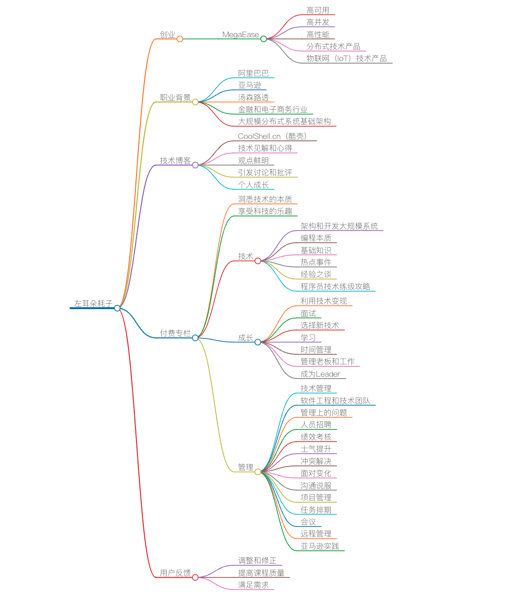

# 开篇词 | 洞悉技术的本质，享受科技的乐趣

你好，我是陈皓，网名左耳朵耗子。我目前在创业，MegaEase 是我的公司，致力于为企业提供高可用、高并发、高性能的分布式技术产品，同时也提供物联网（IoT）方向的技术产品。  

我之前在阿里巴巴、亚马逊、汤森路透等公司任职，职业背景是金融和电子商务行业，主要研究的技术方向是一些大规模分布式系统的基础架构。  

从大学毕业一直做技术工作，到今天有 20 年了，还在写代码，因为我对技术有很大的热情。我从 2002 年开始写技术博客，到 2009 年左右开始在独立的域名 CoolShell.cn（酷壳）上分享我对技术的一些见解和心得。  