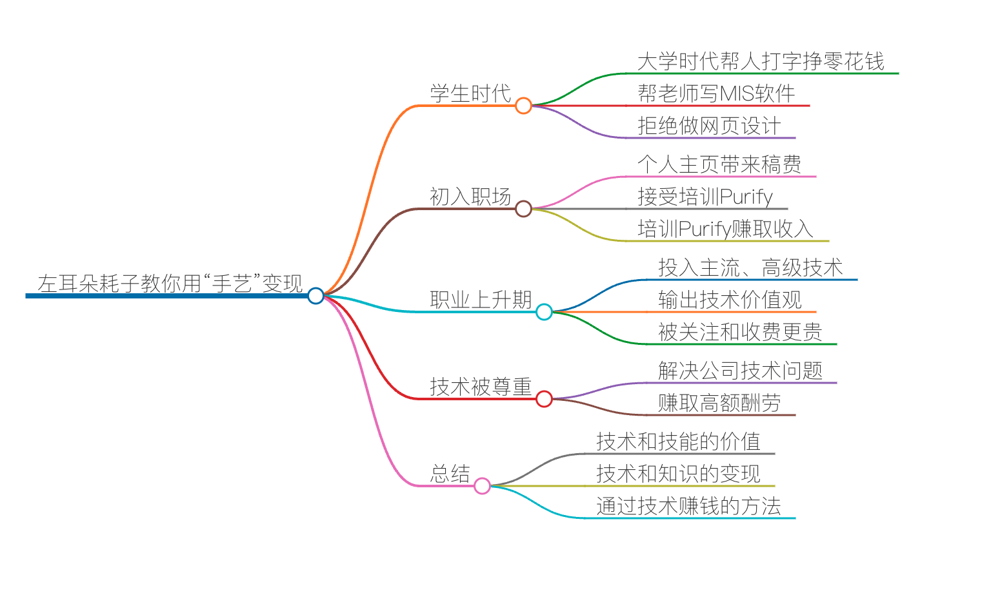

# 01 | 程序员如何用技术变现？（上）

程序员用自己的技术变现，其实是一件天经地义的事儿。写程序是一门“手艺活儿”，那么作为手艺人，程序员当然可以做到靠自己的手艺和技能养活自己。  

然而，现在很多手艺人程序员却说自己是“码农”，编码的农民工，在工作上被各种使唤，各种加班，累得像个牲口。在职业发展上各种迷茫和彷徨，完全看不到未来的希望，更别说可以成为一个手艺人用自己的技能变现了。  

从大学时代帮人打字挣点零花钱，到逐渐通过自己的技能帮助别人，由此获得相对丰厚的收入，我在很早就意识到，从事编程这个事可以做到，完全靠自己的手艺、不依赖任何人或公司去生活的。  

这对于程序员来说，本就应该是件天经地义的事，只是好像并不是所有的程序员都能意识到自己的价值。这里，我想结合我的一些经历来跟你聊聊。当然，我的经历有限，也不一定全对，只希望能给你一个参考。  
