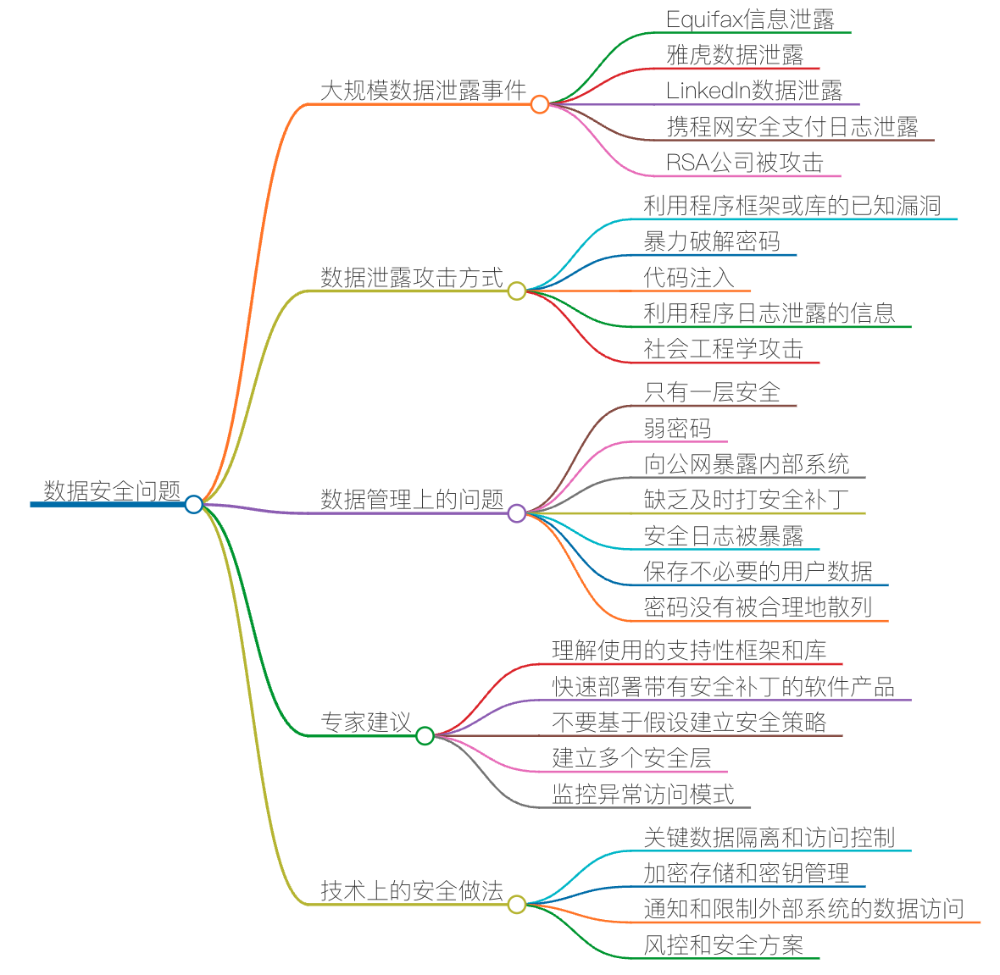

# 从Equifax信息泄露看数据安全

上节课中，我们讲了 Equifax 信息泄露始末，并对造成此次事件的漏洞进行了分析。今天，我们就来回顾一下互联网时代的其他几次大规模数据泄露事件，分析背后的原因，给出解决这类安全问题的技术手段和方法。

## 数据泄露介绍以及历史回顾

类似于 Equifax 这样的大规模数据泄露事件在互联网时代时不时地会发生。上一次如此大规模的数据泄露事件主角应该是雅虎。

继 2013 年大规模数据泄露之后，雅虎在 2014 年又遭遇攻击，泄露出 5 亿用户的密码，直到 2016 年有人在黑市公开交易这些数据时才为大众所知。雅虎股价在事件爆出的第二天就下跌了 2.4%。而此次 Equifax 的股价下跌超过 30%，市值缩水约 53 亿。这让各大企业不得不警惕。

类似的，LinkedIn 在 2012 年也泄露了 6500 万用户名和密码。事件发生后，LinkedIn 为了亡羊补牢，及时阻止被黑账户的登录，强制被黑用户修改密码，并改进了登录措施，从单步认证增强为带短信验证的两步认证。

类似的，LinkedIn 在 2012 年也泄露了 6500 万用户名和密码。事件发生后，LinkedIn 为了亡羊补牢，及时阻止被黑账户的登录，强制被黑用户修改密码，并改进了登录措施，从单步认证增强为带短信验证的两步认证。

国内也有类似的事件。2014 年携程网安全支付日志存在漏洞，导致大量用户信息如姓名、身份证号、银行卡类别、银行卡号、银行卡 CVV 码等信息泄露。这意味着，一旦这些信息被黑客窃取，在网络上盗刷银行卡消费将易如反掌。

如果说网络运维安全是一道防线，那么社会工程学攻击则可能攻破另一道防线——人。2011 年，RSA 公司声称他们被一种复杂的网络攻击所侵害，起因是有两个小组的员工收到一些钓鱼邮件。邮件的附件是带有恶意代码的 Excel 文件。

当一个 RSA 员工打开该 Excel 文件时，恶意代码攻破了 Adobe Flash 中的一个漏洞。该漏洞让黑客能用 Poison Ivy 远程管理工具来取得对机器的管理权，并访问 RSA 内网中的服务器。这次攻击主要威胁的是 SecurID 系统，最终导致了其母公司 EMC 花费 6630 万美元来调查、加固系统，并最终召回和重新分发了 30000 家企业客户的 SecurID 卡片。

## 数据泄露攻击

以这些公司为例，我们来看看这些攻击是怎样实现的。

1. 利用程序框架或库的已知漏洞。比如这次 Equifax 被攻击，就是通过 Apache Struts 的已知漏洞。RSA 被攻击，也利用了 Adobe Flash 的已知漏洞。还有之前的“心脏流血”也是使用了 OpenSSL 的漏洞……
2. 暴力破解密码。利用密码字典库或是已经泄露的密码来“撞库”。
3. 代码注入。通过程序员代码的安全性问题，如 SQL 注入、XSS 攻击、CSRF 攻击等取得用户的权限。
4. 利用程序日志不小心泄露的信息。携程的信息泄露就是本不应该能被读取的日志没有权限保护被读到了。
5. 社会工程学。RSA 被攻击，第一道防线是人——RSA 的员工。只有员工的安全意识增强了，才能抵御此类攻击。其它的如钓鱼攻击也属于此类。

然后，除了表面的攻击之外，窃取到的信息也显示了一些数据管理上的问题。

1. 只有一层安全。Equifax 只是被黑客攻破了管理面板和数据库，就造成了数据泄露。显然这样只有一层安全防护是不够的。
2. 弱密码。Equifax 数据泄露事件绝对是管理问题。至少，密码系统应该不能让用户设置如此简单的密码，而且还要定期更换。最好的方式是通过数据证书、VPN、双因子验证的方式来登录。
3. 向公网暴露了内部系统。在公司网络管理上出现了非常严重的问题。
4. 对系统及时打安全补丁。监控业内的安全漏洞事件，及时作出响应，这是任何一个有高价值数据的公司都需要干的事。
5. 安全日志被暴露。安全日志往往包含大量信息，被暴露是非常危险的。携程的 CVV 泄露就是从日志中被读到的。
6. 保存了不必要保存的用户数据。携程保存了用户的信用卡号、有效期、姓名和 CVV 码，这些信息足以让人在网上盗刷信用卡。其实对于临时支付来说，这些信息完全可以不保存在磁盘上，临时在内存中处理完毕立即销毁，是最安全的做法。即便是快捷支付，也没有必要保存 CVV 码。安全日志也没有必要将所有信息都保存下来，比如可以只保存卡号后四位，也同样可以用于处理程序故障。
7. 密码没有被合理地散列。以现代的安全观念来说，以明文方式保存密码是很不专业的做法。进一步的是只保存密码的散列值（用安全散列算法），LinkedIn 就是这样做的。但是，散列一则需要用目前公认安全的算法（比如 SHA-2 256），而已知被攻破的算法则最好不要使用（如 MD5，能人为找到碰撞，对密码验证来说问题不大），二则要加一个安全随机数作为盐（salt）。LinkedIn 的问题正在于没有加盐，导致密码可以通过预先计算的彩虹表（rainbow table）反查出明文。这些密码明文可以用来做什么事，就不好说了，撞库什么的都有可能了。对用户来说，最好是不同网站用不同密码。

## 专家建议

Contrast Security 是一家安全公司，其 CTO 杰夫·威廉姆斯（ Jeff Williams）在博客中表示，虽说最佳实践是确保不使用有漏洞的程序库，但是在现实中并不容易做到这一点，因为安全更新来得比较频繁。

“经常，为了做这些安全性方面的更改，需要重新编写、测试和部署整个应用程序，而整个周期可能要花费几个月。我最近和几个大的组织机构聊过，他们在应对 CVE-2017-5638 这件事上花了至少四个月的时间。即便是在运营得最好的组织机构中，也经常在漏洞被发布和应用程序被更新之间有几个月的时间差。”威廉姆斯写道。

Apache Struts 的副总裁雷内·吉伦（René Gielen）在 Apache 软件基金会的官方博客中写道，为了避免被攻击，对于使用了开源或闭源的支持性程序库的软件产品或服务，建议如下的 5 条最佳实践。

1. 理解你的软件产品中使用了哪些支持性框架和库，它们的版本号分别是多少。时刻跟踪影响这些产品和版本的最新安全性声明。
2. 建立一个流程，来快速地部署带有安全补丁的软件产品发布版，这样一旦需要因为安全方面的原因而更新支持性框架或库，就可以快速地发布。最好能在几个小时或几天内完成，而不是几周或几个月。我们发现，绝大多数被攻破的情况是因为几个月或几年都没有更新有漏洞的软件组件而引起的。
3. 所有复杂的软件都有漏洞。不要基于“支持性软件产品没有安全性漏洞”这样的假设来建立安全策略。
4. 建立多个安全层。在一个面向公网的表示层（比如 Apache Struts 框架）后面建立多级有安全防护的层次，是一种良好的软件工程实践。就算表示层被攻破，也不会直接提供出重要（或所有）后台信息资源的访问权。
5. 针对公网资源，建立对异常访问模式的监控机制。现在有很多侦测这些行为模式的开源和商业化产品，一旦发现异常访问就能发出警报。作为一种良好的运维实践，我们建议针对关键业务的网页服务应用一定要有这些监控机制。

在吉伦提的第二点中说到，理想的更新时间是在几个小时到几天。我们知道，作为企业，部署了一个版本的程序库，在更新前需要在测试系统上测试各个业务模块，确保兼容以后才能上线。否则，盲目上线一个新版本，一旦遇到不兼容的情况，业务会部分或全部停滞，给客户留下不良印象，经济损失将是不可避免的。因此，这个更新周期必须通过软件工程手段来保证。

一个有力的解决方案是自动化测试。对以数据库为基础的程序库，设置专门的、初始时全空的测试用数据库来进行 API 级别的测试。对于 UI 框架，使用 UI 自动化测试工具进行自动化测试。测试在原则上必须覆盖上层业务模块所有需要的功能，并对其兼容性加以验证。业务模块要连同程序库一起做集成的自动化测试，同时也要有单元测试。

升级前的人工测试也有必要，但由于安全性更新的紧迫性，覆盖主要和重要路径即可。

如果测试发现不兼容性，无法立即升级，那么要考虑的第二点是缓解措施（mitigation）。比如，能否禁用有漏洞的部分而不影响业务？如果不可行，那么是否可以通过 WAF 的设置来把一定特征的攻击载荷挡在门外？这些都是临时解决方案，要到开发部门把业务程序更新为能用新版本库，才能上线新版本的应用程序。

## 技术上的安全做法

除了上面所说的，那些安全防范的方法，我想在这里再加入一些我自己的经验。

从技术上来说，安全防范最好是做到连自己内部员工都能防，因为无论是程序的 BUG 还是漏洞，都是为了取得系统的权限而获得数据。如果我们连内部人都能防的话，那么就可以不用担心绝大多数的系统漏洞了。所谓“家贼难防”，如果要做到这一点，一般来说，有如下的一些方式。

首先，我们需要把我们的关键数据定义出来，然后把这些关键数据隔离出来，隔离到一个安全级别非常高的地方。所谓安全级别非常高的地方，即这个地方需要有各种如安全审计、安全监控、安全访问的区域。

一般来说，在这个区域内，这些敏感数据只入不出。通过提供服务接口来让别的系统只能在这个区域内操作这些数据，而不是把数据传出去，让别的系统在外部来操作这些数据。

举个例子，用户的手机号是敏感信息。如果有外部系统需要使用手机号，一般来说是想发个短信，那么我们这个掌管手机号数据的系统就对外提供发短信的功能，而外部系统通过 UID 或是别的抽象字段来调用这个系统的发短信的 API。信用卡也一样，提供信用卡的扣款 API 而不是把卡号返回给外部系统。

另外，如果业务必须返回用户的数据，一般来说，最终用户可能需要读取自己的数据，那么，对于像信用卡这样的关键数据是死也不能返回全部数据的，只能返回一个被“马赛克”了的数据（隐藏掉部分信息）。就算需要返回一些数据（如用户的地址），那么也需要在传输层上加密返回。

而用户加密的算法一定要采用非对称加密的方式，而且还要加上密钥的自动化更换，比如：在外部系统调用 100 次或是第一个小时后就自动更换加密的密钥。这样，整个系统在运行时就完全是自动化的了，而就算黑客得到了密钥，密匙也会过期，这样可以控制泄露范围。

通过上述手段，我们可以把数据控制在一个比较小的区域内。

而在这个区域内，我们依然会有相关的内部员工可以访问，因此，这个区域中的数据也是需要加密存放的，而加密使用的密钥则需要放在另外一个区域中。

也就是说，被加密的数据和用于加密的密钥是由不同的人来管理的，有密钥的人没有数据，有数据的人没有密钥，这两拨人可以有访问自己系统的权限，但是没有访问对方系统的权限。这样可以让这两拨人互相审计，互相牵制，从而提高数据的安全性。比如，这两拨人是不同公司的。

而密钥一定要做到随机生成，最好是对于不同用户的数据有不同的密钥，并且时不时地就能自动化更新一下，这样就可以做到内部防范。注明一下，按道理来说，用户自己的私钥应该由用户自己来保管，而公司的系统是不存的。而用户需要更新密钥时，需要对用户做身份鉴别，可以通过双因子认证，也可以通过更为严格的物理身份验证。例如，到银行柜台拿身份证重置密码。

最后，每当这些关键信息传到外部系统，需要做通知，最好是通知用户和自己的管理员。并且限制外部系统的数据访问量，超过访问量后，需要报警或是拒绝访问。

上述的这些技术手段是比较常见的做法，虽然也不能确保 100% 防止住，但基本上来说已经将安全级别提得非常高了。

不管怎么样，安全在今天是一个非常严肃的事，能做到绝对的安全基本上是不可能的，我们只能不断提高黑客入侵的门槛。当黑客的投入和收益大大不相符时，黑客也就失去了入侵的意义。

此外，安全还在于“风控”，任何系统就算你做得再完美，也会出现数据泄露的情况，只是我们可以把数据泄露的范围控制在一个什么样的比例，而这个比例就是我们的“风控”。

所谓的安全方案基本上来说就是能够把这个风险控制在一个很小的范围。对于在这个很小范围内出现的一些数据安全的泄露，我们可以通过“风控基金”来做业务上的补偿，比如赔偿用户损失，等等。因为从经济利益上来说，如果风险可以控制在一个——我防范它的成本远高于我赔偿它的成本，那么，还不如赔偿了。
