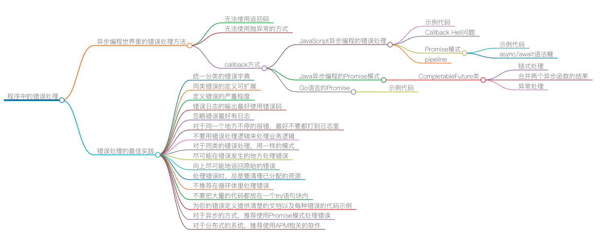

# 程序中的错误处理：异步编程以及我的最佳实践



上节课中，我们讨论了错误返回码和异常捕捉，以及在不同情况下该如何选择和使用。这节课会接着讲两个有趣的话题：异步编程世界里的错误处理方法，以及我在实战中总结出来的错误处理最佳实践。

## 异步编程世界里的错误处理

在异步编程的世界里，因为被调用的函数是被放到了另外一个线程里运行，这将导致：

* 无法使用返回码。因为函数在“被”异步运行中，所谓的返回只是把处理权交给下一条指令，而不是把函数运行完的结果返回。所以，函数返回的语义完全变了，返回码也没有用了。
* 无法使用抛异常的方式。因为除了上述的函数立马返回的原因之外，抛出的异常也在另外一个线程中，不同线程中的栈是完全不一样的，所以主线程的 catch 完全看不到另外一个线程中的异常。

对此，在异步编程的世界里，我们也会有好几种处理错误的方法，最常用的就是 callback 方式。在做异步请求的时候，注册几个 OnSuccess()、 OnFailure() 这样的函数，让在另一个线程中运行的异步代码回调过来。

## JavaScript 异步编程的错误处理

比如，下面这个 JavaScript 示例：

```js

function successCallback(result) {
  console.log("It succeeded with " + result);
}

function failureCallback(error) {
  console.log("It failed with " + error);
}

doSomething(successCallback, failureCallback);

```

通过注册错误处理的回调函数，让异步执行的函数在出错的时候，调用被注册进来的错误处理函数，这样的方式比较好地解决了程序的错误处理。而出错的语义从返回码、异常捕捉到了直接耦合错误出处函数的样子，挺好的。

但是， 如果我们需要把几个异步函数顺序执行的话（异步程序中，程序执行的顺序是不可预测的、也是不确定的，而有时候，函数被调用的上下文是有相互依赖的，所以，我们希望它们能按一定的顺序处理），就会出现了所谓的 Callback Hell 的问题。如下所示：

```js
doSomething(function(result) {
  doSomethingElse(result, function(newResult) {
    doThirdThing(newResult, function(finalResult) {
      console.log('Got the final result: ' + finalResult);
    }, failureCallback);
  }, failureCallback);
}, failureCallback);
```

而这样层层嵌套中需要注册的错误处理函数也有可能是完全不一样的，而且会导致代码非常混乱，难以阅读和维护。

所以，一般来说，在异步编程的实践里，我们会用 Promise 模式来处理。如下所示（箭头表达式）：

```js
doSomething()
.then(result => doSomethingElse(result))
.then(newResult => doThirdThing(newResult))
.then(finalResult => {
  console.log(`Got the final result: ${finalResult}`);
}).catch(failureCallback);
```

上面代码中的 then() 和 catch() 方法就是 Promise 对象的方法，then()方法可以把各个异步的函数给串联起来，而catch() 方法则是出错的处理。

看到上面的那个级联式的调用方式，这就要我们的 doSomething() 函数返回 Promise 对象，下面是这个函数的相关代码示例：

比如：

```js
function doSomething() {
  let promise = new Promise();
  let xhr = new XMLHttpRequest();
  xhr.open('GET', 'http://coolshell.cn/....', true);

  xhr.onload = function (e) {
        if (this.status === 200) {
            results = JSON.parse(this.responseText);
            promise.resolve(results); //成功时，调用resolve()方法
        }
    };

    xhr.onerror = function (e) {
        promise.reject(e); //失败时，调用reject()方法
    };

    xhr.send();
    return promise;
}
```

从上面的代码示例中，我们可以看到，如果成功了，要调用

Promise.resolve() 方法，这样 Promise 对象会继续调用下一个 then()。如果出错了就调用 Promise.reject() 方法，这样就会忽略后面的 then() 直到 catch() 方法。

我们可以看到 Promise.reject() 就像是抛异常一样。这个编程模式让我们的代码组织方便了很多。

另外，多说一句，Promise 还可以同时等待两个不同的异步方法。比如下面的代码所展示的方式：

```js
promise1 = doSomething();
promise2 = doSomethingElse();
Promise.when(promise1, promise2).then( function (result1, result2) {
  ... //处理 result1 和 result2 的代码
}, handleError);
```

在 ECMAScript 2017 的标准中，我们可以使用async/await这两个关键字来取代 Promise 对象，这样可以让我们的代码更易读。

比如下面的代码示例：

```js
async function foo() {
  try {
    let result = await doSomething();
    let newResult = await doSomethingElse(result);
    let finalResult = await doThirdThing(newResult);
    console.log(`Got the final result: ${finalResult}`);
  } catch(error) {
    failureCallback(error);
  }
}
```

如果在函数定义之前使用了 async 关键字，就可以在函数内使用 await。 当在 await 某个 Promise 时，函数暂停执行，直至该  Promise 产生结果，并且暂停不会阻塞主线程。 如果 Promise resolve，则会返回值。 如果 Promise reject，则会抛出拒绝的值。

而我们的异步代码完全可以放在一个 try - catch 语句块内，在有语言支持了以后，我们又可以使用 try - catch 语句块了。

下面我们来看一下 pipeline 的代码。所谓 pipeline 就是把一串函数给编排起来，从而形成更为强大的功能。这个玩法是函数式编程中经常用到的方法。

比如，下面这个 pipeline 的代码（注意，其上使用了 reduce() 函数）：

```js
[func1, func2].reduce((p, f) => p.then(f), Promise.resolve());
```

其等同于：

```js
Promise.resolve().then(func1).then(func2);
```

我们可以抽象成：

```js
let applyAsync = (acc,val) => acc.then(val);
let composeAsync = (...funcs) => x => funcs.reduce(applyAsync, Promise.resolve(x));
```

于是，可以这样使用：

```js
let transformData = composeAsync(func1, asyncFunc1, asyncFunc2, func2);
transformData(data);
```

但是，在 ECMAScript 2017 的 async/await 语法糖下，这事儿就变得更简单了。

```js
for (let f of [func1, func2]) {
  await f();
}
```

## Java 异步编程的 Promise 模式

在 Java 中，在 JDK 1.8 里也引入了类似 JavaScript 的玩法 —— CompletableFuture。这个类提供了大量的异步编程中 Promise 的各种方式。下面我列举几个。

链式处理：

```js
CompletableFuture.supplyAsync(this::findReceiver)
                 .thenApply(this::sendMsg)
                 .thenAccept(this::notify);
```

上面的这个链式处理和 JavaScript 中的then()方法很像，其中的

supplyAsync() 表示执行一个异步方法，而 thenApply() 表示执行成功后再串联另外一个异步方法，最后是 thenAccept() 来处理最终结果。

下面这个例子是要合并两个异步函数的结果：

```java
String result = CompletableFuture.supplyAsync(() -> {
         return "hello";
     }).thenCombine(CompletableFuture.supplyAsync(() -> {
         return "world";
     }), (s1, s2) -> s1 + " " + s2).join());
System.out.println(result);
```

接下来，我们再来看一下，Java 这个类相关的异常处理：

```java
CompletableFuture.supplyAsync(Integer::parseInt) //输入: "ILLEGAL"
           .thenApply(r -> r * 2 * Math.PI)
           .thenApply(s -> "apply>> " + s)
           .exceptionally(ex -> "Error: " + ex.getMessage());
```

我们要注意到上面代码里的 exceptionally() 方法，这个和 JavaScript Promise 中的 catch() 方法相似。

运行上面的代码，会出现如下输出：

```java
Error: java.lang.NumberFormatException: For input string: "ILLEGAL"
```

也可以这样：

```java
CompletableFuture.supplyAsync(Integer::parseInt) // 输入: "ILLEGAL"
         .thenApply(r -> r * 2 * Math.PI)
         .thenApply(s -> "apply>> " + s)
         .handle((result, ex) -> {
           if (result != null) {
             return result;
           } else {
             return "Error handling: " + ex.getMessage();
           }
         });
```

上面代码中，你可以看到，其使用了 handle() 方法来处理最终的结果，其中包含了异步函数中的错误处理。

## Go 语言的 Promise

在 Go 语言中，如果你想实现一个简单的 Promise 模式，也是可以的。下面的代码纯属示例，只为说明问题。如果你想要更好的代码，可以上 GitHub 上搜一下 Go 语言 Promise 的相关代码库。

首先，先声明一个结构体。其中有三个成员：第一个 wg 用于多线程同步；第二个 res 用于存放执行结果；第三个 err 用于存放相关的错误。

```go
type Promise struct {
  wg  sync.WaitGroup
  res string
  err error
}
```

然后，定义一个初始函数，来初始化 Promise 对象。其中可以看到，需要把一个函数 f() 传进来，然后调用 wg.Add(1) 对 waitGroup 做加一操作，新开一个 Goroutine 通过异步去执行用户传入的函数 f() ，然后记录这个函数的成功或错误，并把 waitGroup 做减一操作。

```go
func NewPromise(f func() (string, error)) *Promise {
  p := &Promise{}
  p.wg.Add(1)
  go func() {
    p.res, p.err = f()
    p.wg.Done()
  }()
  return p
}
```

然后，我们需要定义 Promise 的 Then 方法。其中需要传入一个函数，以及一个错误处理的函数。并且调用 wg.Wait() 方法来阻塞（因为之前被wg.Add(1))，一旦上一个方法被调用了 wg.Done()，这个 Then 方法就会被唤醒。

唤醒的第一件事是，检查一下之前的方法有没有错误。如果有，那么就调用错误处理函数。如果之前成功了，就把之前的结果以参数的方式传入到下一个函数中。

```go
func (p *Promise) Then(r func(string), e func(error)) (*Promise){
  go func() {
    p.wg.Wait()
    if p.err != nil {
      e(p.err)
      return 
    }
    r(p.res)
  }()
  return p
}
```

下面，我们定义一个用于测试的异步方法。这个方法很简单，就是在数数，然后，有一半的几率会出错。

```go
func exampleTicker() (string, error) {
  for i := 0; i < 3; i++ {
    fmt.Println(i)
    <-time.Tick(time.Second * 1)
  }
  
  rand.Seed(time.Now().UTC().UnixNano())
  r:=rand.Intn(100)%2
  fmt.Println(r)
  if  r != 0 {
    return "hello, world", nil
  } else {
    return "", fmt.Errorf("error")
  }
}
```

下面，我们来看看我们实现的 Go 语言 Promise 是怎么使用的。代码还是比较直观的，我就不做更多的解释了。

```go
func main() {
  doneChan := make(chan int)
  
  var p = NewPromise(exampleTicker)
  p.Then(func(result string) { fmt.Println(result); doneChan <- 1 }, 
      func(err error) { fmt.Println(err); doneChan <-1 })
      
  <-doneChan
}
```

当然，如果你需要更好的 Go 语言 Promise，可以到 GitHub 上找，上面好些代码都是实现得很不错的。上面的这个示例，实现得比较简陋，仅仅是为了说明问题。

## 错误处理的最佳实践

下面是我个人总结的几个错误处理的最佳实践。如果你知道更好的，请一定告诉我。

* 统一分类的错误字典。无论你是使用错误码还是异常捕捉，都需要认真并统一地做好错误的分类。最好是在一个地方定义相关的错误。比如，HTTP 的 4XX 表示客户端有问题，5XX 则表示服务端有问题。也就是说，你要建立一个错误字典。
* 同类错误的定义最好是可以扩展的。这一点非常重要，而对于这一点，通过面向对象的继承或是像 Go 语言那样的接口多态可以很好地做到。这样可以方便地重用已有的代码。
* 定义错误的严重程度。比如，Fatal 表示重大错误，Error 表示资源或需求得不到满足，Warning 表示并不一定是个错误但还是需要引起注意，Info 表示不是错误只是一个信息，Debug 表示这是给内部开发人员用于调试程序的。
* 错误日志的输出最好使用错误码，而不是错误信息。打印错误日志的时候，应该使用统一的格式。但最好不要用错误信息，而应使用相应的错误码，错误码不一定是数字，也可以是一个能从错误字典里找到的一个唯一的可以让人读懂的关键字。这样，会非常有利于日志分析软件进行自动化监控，而不是要从错误信息中做语义分析。比如：HTTP 的日志中就会有 HTTP 的返回码，如：404。但我更推荐使用像PageNotFound这样的标识，这样人和机器都很容易处理
* 忽略错误最好有日志。不然会给维护带来很大的麻烦。
* 对于同一个地方不停的报错，最好不要都打到日志里。不然这样会导致其它日志被淹没了，也会导致日志文件太大。最好的实践是，打出一个错误以及出现的次数。
* 不要用错误处理逻辑来处理业务逻辑。也就是说，不要使用异常捕捉这样的方式来处理业务逻辑，而是应该用条件判断。如果一个逻辑控制可以用 if - else 清楚地表达，那就不建议使用异常方式处理。异常捕捉是用来处理不期望发生的事情，而错误码则用来处理可能会发生的事。
* 对于同类的错误处理，用一样的模式。比如，对于null对象的错误，要么都用返回 null，加上条件检查的模式，要么都用抛 NullPointerException 的方式处理。不要混用，这样有助于代码规范。
* 尽可能尽可能在错误发生的地方处理错误。因为这样会让调用者变得更简单。
* 向上尽可能地返回原始的错误。如果一定要把错误返回到更高层去处理，那么，应该返回原始的错误，而不是重新发明一个错误。
* 处理错误时，总是要清理已分配的资源。这点非常关键，使用 RAII 技术，或是try-catch-finally，或是 Go 的 defer 都可以容易地做到。
* 不推荐在循环体里处理错误。这里说的是try-catch，绝大多数的情况你不需要这样做。最好把整个循环体外放在 try 语句块内，而在外面做 catch。'
* 不要把大量的代码都放在一个 try 语句块内。一个 try 语句块内的语句应该是完成一个简单单一的事情。
* 为你的错误定义提供清楚的文档以及每种错误的代码示例。如果你是做 RESTful API 方面的，使用 Swagger 会帮你很容易搞定这个事。
* 对于异步的方式，推荐使用 Promise 模式处理错误。对于这一点，JavaScript 中有很好的实践。
* 对于分布式的系统，推荐使用 APM 相关的软件。尤其是使用 Zipkin 这样的服务调用跟踪的分析来关联错误。
