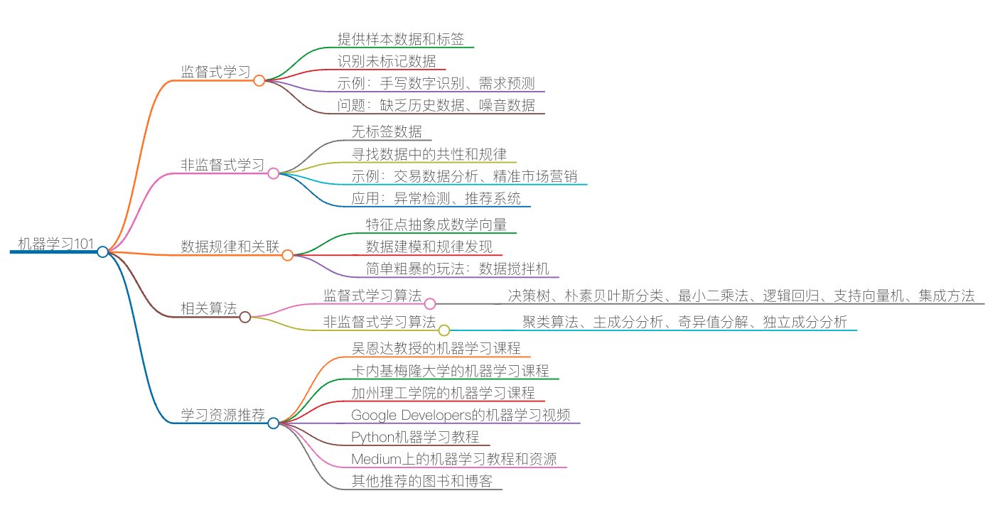

# 推荐阅读：机器学习101

自从 2012 年在亚马逊第一次接触机器学习（一个关于预测商品需求的 Demand Forecasting 的项目）以来，我一直在用一些零星的时间学习机器学习相关的东西。所以，说实话，在机器学习方面，我也只是一个新手，也在入门阶段。

在前面课程的评论中，有网友希望我写一篇有关大数据和机器学习的文章，老实说，有点为难我了。所以，我只能结合自己的学习过程写一篇入门级的文章，希望能看到高手的指教和指正。

首先，简单介绍一下机器学习的一些原理。机器学习主要来说有两种方法，监督式学习（Supervised Learning）和非监督式学习（Unsupervised Learning）。

## 监督式学习

所谓监督式学习，也就是说，我们需要提供一组学习样本，包括相关的特征数据以及相应的标签。程序可以通过这组样本来学习相关的规律或是模式，然后通过得到的规律或模式来判断没有被打过标签的数据是什么样的数据。

举个例子，假设需要识别一些手写的数字，那么我们就需要找到尽可能多的手写体数字的图像样本，然后人工或是通过某种算法来明确地标注什么是这些手写体的图片，谁是 1，谁是 2，谁是 3……这组数据就叫样本数据，又叫训练数据（training data）。

通过机器学习的算法，我们可以找到每个数字在不同手写体下的特征，进而找到规律和模式。然后通过得到的规律或模式来识别那些没有被打过标签的手写数据，以此完成识别手写体数字的目标。

一种比较常见的监督式学习，就是从历史数据中获得数据的走向趋势，来预测未来的走向。比如，我们使用历史上的股票走势数据来预测接下来的股价涨跌，或者通过历史上的一些垃圾邮件的样本来识别新的垃圾邮件

在监督式学习下，需要有样本数据或是历史数据来进行学习，这种方式会有一些问题。比如：

* 如果一个事物没有历史数据，那么就不好做了。变通的解决方式是通过一个和其类似事物的历史数据。我以前做过的需求预测，就属于这种情况。对于新上市的商品来说，完全没有历史数据，比如，iPhone X，那么就需要从其类似的商品上找历史数据，如 iPhone 7 或是别的智能手机
* 历史数据中可能会有一些是噪音数据，需要把这些噪音数据给过滤掉。一般这样的过滤方式要通过人工判断和标注。举两个例子，某名人在其微博或是演讲上推荐了一本书，于是这本书的销量就上升了。这段时间的历史数据不是规律性的，所以就不能成为样本数据，需要去掉。同样，如果某名人（如 Michael Jackson）去世导致和其有关的商品销售量很好，那么，这个事件所产生的数据则不属于噪音数据。因为每年这个名人忌日的时候出现销量上升的可能性非常高，所以，需要标注一下，这是有规律的样本，可以放入样本进行学习。

## 非监督式学习

对于非监督式学习，也就是说，数据是没有被标注过的，所以相关的机器学习算法需要找到这些数据中的共性。因为大量的数据是没有被标识过的，所以这种学习方式可以让大量未标识的数据能够更有价值。

而且，非监督式的学习，可以为我们找到人类很难发现的数据里的规律或模型。所以，也有人将这种学习称为“特征点学习”。其可以让我们自动地为数据进行分类，并找到分类的模型。

一般来说，非监督式学习会应用在一些交易型的数据中。比如，有一堆的用户购买数据，但是对于人类来说，我们很难找到用户属性和购买商品类型之间的关系，而非监督式学习算法可以帮助我们找到他们之间的关系。

比如，一个在某一年龄段区间的女生购买了某种肥皂，有可能说明这个女生在怀孕期，或是某人购买儿童用品，有可能说明这个人的关系链中有孩子，等等。于是这些信息会被用在一些所谓的精准市场营销活动中，从而可以增加商品销量。

我们这么来说吧，监督式学习是在被告诉过正确的答案之后的学习，而非监督式学习是在没有被告诉正确答案时的学习，所以说，非监督式的学习是在大量的非常混乱的数据中找寻一些潜在的关系，这个成本也比较高。

这种非监督式学习也会经常被用来检测一些不正常的事情发生，比如信用卡的诈骗或是盗刷。也有被用在推荐系统中，比如买了这个商品的人又买了别的什么东西，或是如果某个人喜欢某篇文章、某个音乐、某个餐馆，那么可能他会喜欢某款车、某个明星，或某个地方。

在监督式的学习的算法下，我们可以用一组“狗”的照片来确定某个照片中的物体是不是狗。而在非监督式的学习算法下，我们可以通过一个照片来找到与其相似事物的照片。这两种学习方式都有各自适用的场景。

## 如何找到数据的规律和关联

机器学习基本就是在已知的样本数据中寻找数据的规律，在未知的数据中找数据的关系。所以，这就需要一定的数学知识了，但对于刚入门的人来说，学好高数、线性代数、概率论、数据建模等大学本科的数学知识应该就够用了。以前上大学时，总觉得这些知识没什么用处，原来只不过是自己太 low，还没有从事会运用到这些知识的工作。

总之，机器学习中的基本方法论是这样的。

1. 要找到数据中的规律，你需要找到数据中的特征点。
2. 把特征点抽象成数学中的向量，也就是所谓的坐标轴。一个复杂的学习可能会有成十上百的坐标轴。
3. 抽象成数学向量后，就可以通过某种数学公式来表达这类数据（就像 y=ax+b 是直线的公式），这就是数据建模。

这个数据公式就是我们找出来的规律。通过这个规律，我们才可能关联类似的数据。

当然，也有更为简单粗暴的玩法。

1. 把数据中的特征点抽象成数学中的向量。
2. 每个向量一个权重。
3. 写个算法来找各个向量的权重是什么。

有人把这个事叫“数据搅拌机”。据说，这种简单粗暴的方式超过了那些所谓的明确的数学公式或规则。这种“土办法”有时候会比高大上的数学更有效，哈哈。

关于机器学习这个事，你可以读一读 [Machine Learning is Fun](https://medium.com/@ageitgey/machine-learning-is-fun-80ea3ec3c471)， [这篇文章](https://zhuanlan.zhihu.com/p/24339995)。

## 相关算法

对于监督式学习，有如下经典算法。

1. 决策树（Decision Tree）。比如自动化放贷、风控。
2. 朴素贝叶斯分类（Naive Bayesian classification）。可以用于判断垃圾邮件，对新闻的类别进行分类，比如科技、政治、运动，判断文本表达的感情是积极的还是消极的，以及人脸识别等。
3. 最小二乘法（Ordinary Least Squares Regression）。算是一种线性回归。
4. 逻辑回归（Logisitic Regression）。一种强大的统计学方法，可以用一个或多个变量来表示一个二项式结果。它可以用于信用评分、计算营销活动的成功率、预测某个产品的收入等。
5. 支持向量机（Support Vector Machine，SVM）。可以用于基于图像的性别检测，图像分类等。
6. 集成方法（Ensemble methods）。通过构建一组分类器，然后根据它们的预测结果进行加权投票来对新的数据点进行分类。原始的集成方法是贝叶斯平均，但是最近的算法包括纠错输出编码、Bagging 和 Boosting。

对于非监督式的学习，有如下经典算法。

1. 聚类算法（Clustering Algorithms）。聚类算法有很多，目标是给数据分类。
2. 主成分分析（Principal Component Analysis，PCA）。PCA 的一些应用包括压缩、简化数据，便于学习和可视化等。
3. 奇异值分解（Singular Value Decomposition，SVD）。实际上，PCA 是 SVD 的一个简单应用。在计算机视觉中，第一个人脸识别算法使用 PCA 和 SVD 来将面部表示为“特征面”的线性组合，进行降维，然后通过简单的方法将面部匹配到身份。虽然现代方法更复杂，但很多方面仍然依赖于类似的技术。
4. 独立成分分析（Independent Component Analysis，ICA）。ICA 是一种统计技术，主要用于揭示随机变量、测量值或信号集中的隐藏因素。

上面的这些相关算法来源自博文[《The 10 Algorithms Machine Learning Engineers Need to Know》](https://www.kdnuggets.com/2016/08/10-algorithms-machine-learning-engineers.html)。

## 相关推荐

学习机器学习有几个课是必须要上的，具体如下。

* 吴恩达教授（Andrew Ng）在 [Coursera](https://www.coursera.org/learn/machine-learning) 上的机器学习课程非常棒。我强烈建议从此入手。对于任何拥有计算机科学学位的人，或是还能记住一点点数学的人来说，都非常容易入门。这个斯坦福大学的课程后面是有作业的，请尽量拿满分。另外，网易公开课上也有该课程。
* 卡内基梅隆大学计算机科学学院汤姆·米切尔（Tom Mitchell）教授的机器学习课程，这里有[英文原版视频和课件 PDF](https://www.cs.cmu.edu/~tom/10701_sp11/lectures.shtml) 。汤姆·米切尔是全球 AI 界顶级大牛，在机器学习、人工智能、认知神经科学等领域都有建树，撰写了机器学习方面最早的教科书之一《机器学习》，被誉为入门必读图书。
* 加利福尼亚理工学院亚瑟·阿布·穆斯塔法（Yaser Abu-Mostafa）教授的 [Learning from Data](https://work.caltech.edu/lectures.html) 系列课程 。本课程涵盖机器学习的基本理论和算法，并将理论与实践相结合，更具实践指导意义，适合进阶。

除了上述的那些课程外，下面这些资源也很不错。

* YouTube 上的 Google Developers 的 [Machine Learning Recipes with Josh Gordon](https://www.youtube.com/playlist?list=PLOU2XLYxmsIIuiBfYad6rFYQU_jL2ryal) 。这 9 集视频，每集不到 10 分钟，从 Hello World 讲到如何使用 TensorFlow，值得一看。
* 还有 [Practical Machine Learning Tutorial with Python Introduction](https://pythonprogramming.net/machine-learning-tutorial-python-introduction/) 上面一系列的用 Python 带着你玩 Machine Learning 的教程。
* Medium 上的 [Machine Learning - 101](https://medium.com/machine-learning-101) 讲述了好多我们上面提到过的经典算法。
* 还有，Medium 上的 [Machine Learning for Humans](https://medium.com/machine-learning-for-humans)，不仅提供了入门指导，更介绍了各种优质的学习资源。
* [杰森·布朗利（Jason Brownlee）博士的博客](https://machinelearningmastery.com/blog/) 也是非常值得一读，其中好多的 “How-To”，会让你有很多的收获。
* [i am trask](https://iamtrask.github.io/) 也是一个很不错的博客。
* 关于 Deep Learning 中神经网络的学习，推荐 YouTube 介绍视频 [Neural Networks](https://www.youtube.com/playlist?list=PLZHQObOWTQDNU6R1_67000Dx_ZCJB-3pi)。
* 用 Python 做自然语言处理[Natural Language Processing with Python](http://www.nltk.org/book/)。
* 以及 GitHub 上的 [Machine Learning 和 Deep Learning](https://github.com/ujjwalkarn/Machine-Learning-Tutorials) 的相关教程列表。

此外，还有一些值得翻阅的图书。

* [《机器学习》](https://cs.nju.edu.cn/zhouzh/zhouzh.files/publication/MLbook2016.htm)，南京大学周志华教授著。它是一本机器学习方面的入门级教科书，适合本科三年级以上的学生学习。这本书如同一张地图一般，让你能“观其大略”，了解机器学习的各个种类、各个学派，其覆盖面与同类英文书籍相较不遑多让。
* [A Course In Machine Learning](http://ciml.info/)，马里兰大学哈尔·道姆（Hal Daumé III）副教授著。这本书讲述了几种经典机器学习算法，包括决策树、感知器神经元、kNN 算法、K-means 聚类算法、各种线性模型（包括对梯度下降、支持向量机等的介绍）、概率建模、神经网络、非监督学习等很多主题，还讲了各种算法使用时的经验技巧，适合初学者学习。此外，官网还提供了免费电子版。
* [Deep Learning](http://www.deeplearningbook.org/)，麻省理工学院伊恩·古德费洛（Ian Goodfellow）、友华·本吉奥（Yoshua Benjio）和亚伦·考维尔（Aaron Courville）著。这本书是深度学习专题的经典图书。它从历史的角度，将读者带进深度学习的世界。深度学习使用多层的（深度的）神经元网络，通过梯度下降算法来实现机器学习，对于监督式和非监督式学习都有大量应用。如果读者对该领域有兴趣，可以深入阅读本书。本书官网提供免费电子版，但不提供下载。实体书（英文原版或中文翻译版）可以在网上买到。
* [Reinforcement Learning](http://www.freetechbooks.com/reinforcement-learning-an-introduction-second-edition-draft-t1282.html)，安德鲁·巴托（Andrew G.Barto）和理查德·萨顿（Richard S. Sutton）著。这本书是强化学习（Reinforcement Learning）方面的入门书。它覆盖了马尔可夫决策过程（MDP）、Q-Learning、Sarsa、TD-Lamda 等方面。这本书的作者是强化学习方面的创始人之一。强化学习（结合深度学习）在围棋程序 AlphaGo 和自动驾驶等方面都有着重要的应用。
* [Pattern Recognition and Machine Learning](https://www.amazon.com/Pattern-Recognition-Learning-Information-Statistics/dp/0387310738) ，微软剑桥研究院克里斯托夫·比肖普（Christoph M. Bishop）著。这本书讲述了模式识别的技术，包括机器学习在模式识别中的应用。模式识别在图像识别、自然语言处理、控制论等多个领域都有应用。日常生活中扫描仪的 OCR、平板或手机的手写输入等都属于该领域的研究。

好了，今天推荐的内容就这些。我目前也在学习中，希望能够跟你一起交流探讨，也期望能得到你的指教和帮助。
