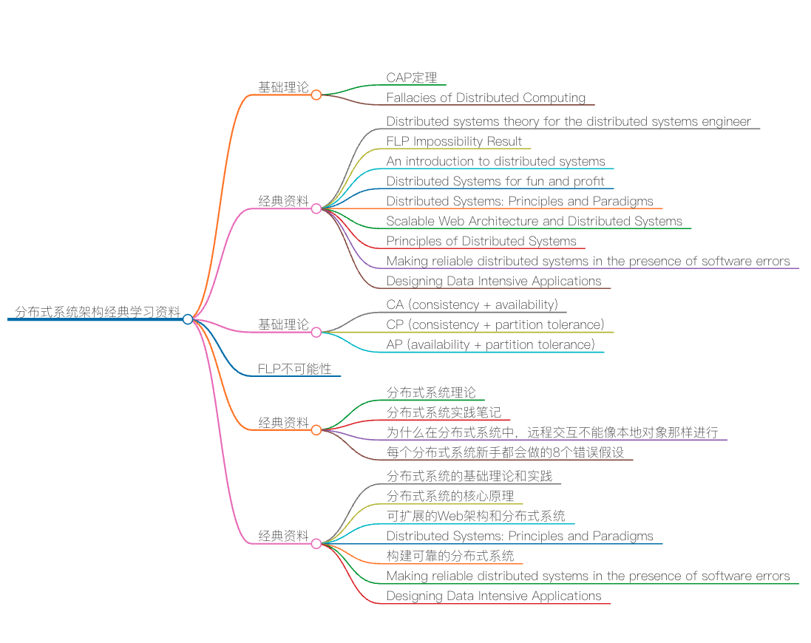
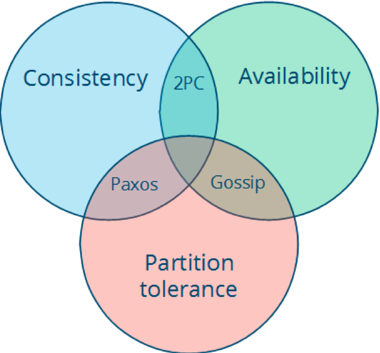
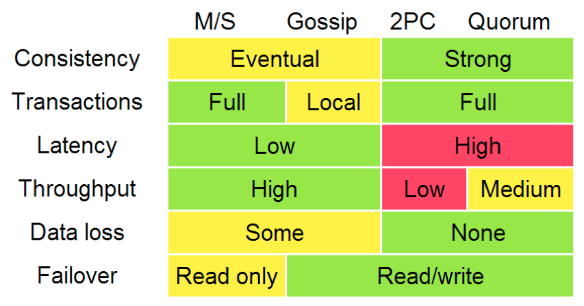

# 分布式系统架构经典资料

就像我在前面的课程中多次提到的，分布式系统的技术栈巨大无比，所以我要推荐的学习资料也比较多，后面在课程中我会结合主题逐步推荐给你。在今天这一讲中，我将推荐一些分布式系统的基础理论和一些不错的图书和资料。

这一讲比较长，所以我特意整理了目录，帮你快速找到自己感兴趣的内容。

## 基础理论

* CAP 定理
* Fallacies of Distributed Computing

## 经典资料

* Distributed systems theory for the distributed systems engineer
* FLP Impossibility Result
* An introduction to distributed systems
* Distributed Systems for fun and profit
* Distributed Systems: Principles and Paradigms
* Scalable Web Architecture and Distributed Systems
* Principles of Distributed Systems
* Making reliable distributed systems in the presence of software errors
* Designing Data Intensive Applications

## 基础理论

下面这些基础知识有可能你已经知道了，不过还是容我把它分享在这里。我希望用比较通俗易懂的文字将这些枯燥的理论知识讲清楚。

* [CAP 定理](https://en.wikipedia.org/wiki/CAP_theorem)

CAP 定理是分布式系统设计中最基础，也是最为关键的理论。它指出，分布式数据存储不可能同时满足以下三个条件。

* 一致性（Consistency）：每次读取要么获得最近写入的数据，要么获得一个错误。
* 可用性（Availability）：每次请求都能获得一个（非错误）响应，但不保证返回的是最新写入的数据。
* 分区容忍（Partition tolerance）：尽管任意数量的消息被节点间的网络丢失（或延迟），系统仍继续运行。

也就是说，CAP 定理表明，在存在网络分区的情况下，一致性和可用性必须二选一。而在没有发生网络故障时，即分布式系统正常运行时，一致性和可用性是可以同时被满足的。这里需要注意的是，CAP 定理中的一致性与 ACID 数据库事务中的一致性截然不同。

掌握 CAP 定理，尤其是能够正确理解 C、A、P 的含义，对于系统架构来说非常重要。因为对于分布式系统来说，网络故障在所难免，如何在出现网络故障的时候，维持系统按照正常的行为逻辑运行就显得尤为重要。你可以结合实际的业务场景和具体需求，来进行权衡。

例如，对于大多数互联网应用来说（如门户网站），因为机器数量庞大，部署节点分散，网络故障是常态，可用性是必须要保证的，所以只有舍弃一致性来保证服务的 AP。而对于银行等，需要确保一致性的场景，通常会权衡 CA 和 CP 模型，CA 模型网络故障时完全不可用，CP 模型具备部分可用性。

* CA (consistency + availability)，这样的系统关注一致性和可用性，它需要非常严格的全体一致的协议，比如“两阶段提交”（2PC）。CA 系统不能容忍网络错误或节点错误，一旦出现这样的问题，整个系统就会拒绝写请求，因为它并不知道对面的那个结点是否挂掉了，还是只是网络问题。唯一安全的做法就是把自己变成只读的。
* CP (consistency + partition tolerance)，这样的系统关注一致性和分区容忍性。它关注的是系统里大多数人的一致性协议，比如：Paxos 算法（Quorum 类的算法）。这样的系统只需要保证大多数结点数据一致，而少数的结点会在没有同步到最新版本的数据时变成不可用的状态。这样能够提供一部分的可用性。
* AP (availability + partition tolerance)，这样的系统关心可用性和分区容忍性。因此，这样的系统不能达成一致性，需要给出数据冲突，给出数据冲突就需要维护数据版本。Dynamo 就是这样的系统。

然而，还是有一些人会错误地理解 CAP 定理，甚至误用。Cloudera 工程博客中，[CAP Confusion: Problems with ‘partition tolerance’](http://blog.cloudera.com/blog/2010/04/cap-confusion-problems-with-partition-tolerance/)一文中对此有详细的阐述。

在谷歌的[Transaction Across DataCenter](http://www.youtube.com/watch?v=srOgpXECblk) 视频中，我们可以看到下面这样的图。这个是 CAP 理论在具体工程中的体现。

[Fallacies of Distributed Computing](http://en.wikipedia.org/wiki/Fallacies_of_distributed_computing)

本文是英文维基百科上的一篇文章。它是 Sun 公司的[劳伦斯·彼得·多伊奇（Laurence Peter Deutsch）](https://en.wikipedia.org/wiki/L_Peter_Deutsch)等人于 1994~1997 年提出的，讲的是刚刚进入分布式计算领域的程序员常会有的一系列错误假设。

多伊奇于 1946 年出生在美国波士顿。他创办了阿拉丁企业（Aladdin Enterprises），并在该公司编写出了著名的 Ghostscript 开源软件，于 1988 年首次发布。

他在学生时代就和艾伦·凯（Alan Kay）等比他年长的人一起开发了 Smalltalk，并且他的开发成果激发了后来 Java 语言 JIT 编译技术的创造灵感。他后来在 Sun 公司工作并成为 Sun 公司的院士。在 1994 年，他成为了 ACM 院士。

基本上，每个人刚开始建立一个分布式系统时，都做了以下 8 条假定。随着时间的推移，每一条都会被证明是错误的，也都会导致严重的问题，以及痛苦的学习体验。

1. 网络是稳定的。
2. 网络传输的延迟是零。
3. 网络的带宽是无穷大。
4. 网络是安全的。
5. 网络的拓扑不会改变。
6. 只有一个系统管理员。
7. 传输数据的成本为零。
8. 整个网络是同构的。

阿尔农·罗特姆 - 盖尔 - 奥兹（Arnon Rotem-Gal-Oz）写了一篇长文[Fallacies of Distributed Computing Explained](http://www.rgoarchitects.com/Files/fallacies.pdf)来解释这些点。

由于他写这篇文章的时候已经是 2006 年了，所以从中能看到这 8 条常见错误被提出十多年后还有什么样的影响：一是，为什么当今的分布式软件系统也需要避免这些设计错误；二是，在当今的软硬件环境里，这些错误意味着什么。比如，文中在谈“延迟为零”假设时，还谈到了 AJAX，而这是 2005 年开始流行的技术。

而[加勒思·威尔逊（Gareth Wilson）](http://blog.fogcreek.com/eight-fallacies-of-distributed-computing-tech-talk/)的文章则用日常生活中的例子，对这些点做了更为通俗的解释。

这 8 个需要避免的错误不仅对于中间件和底层系统开发者及架构师是重要的知识，而且对于网络应用程序开发者也同样重要。分布式系统的其他部分，如容错、备份、分片、微服务等也许可以对应用程序开发者部分透明，但这 8 点则是应用程序开发者也必须知道的。

为什么我们要深刻地认识这 8 个错误？是因为，这要我们清楚地认识到——在分布式系统中错误是不可能避免的，我们能做的不是避免错误，而是要把错误的处理当成功能写在代码中。

后面，我会写一个系列的文章来谈一谈，分布式系统容错设计中的一些常见设计模式。敬请关注！

## 经典资料

[Distributed systems theory for the distributed systems engineer](https://www.the-paper-trail.org/blog/distributed-systems-theory-for-the-distributed-systems-engineer/)

本文作者认为，推荐大量的理论论文是学习分布式系统理论的错误方法，除非这是你的博士课程。因为论文通常难度大又很复杂，需要认真学习，而且需要理解这些研究成果产生的时代背景，才能真正地领悟到其中的精妙之处。

在本文中，作者给出了他整理的分布式工程师必须要掌握的知识列表，并直言掌握这些足够设计出新的分布式系统。首先，作者推荐了 4 份阅读材料，它们共同概括了构建分布式系统的难点，以及所有工程师必须克服的技术难题。

* [Distributed Systems for Fun and Profit](https://book.mixu.net/distsys/)，这是一本小书，涵盖了分布式系统中的关键问题，包括时间的作用和不同的复制策略。后文中对这本书有较详细的介绍。
* [Notes on distributed systems for young bloods](https://www.somethingsimilar.com/2013/01/14/notes-on-distributed-systems-for-young-bloods/)，这篇文章中没有理论，是一份适合新手阅读的分布式系统实践笔记。
* [A Note on Distributed Systems](https://citeseerx.ist.psu.edu/viewdoc/summary?doi=10.1.1.41.7628)，这是一篇经典的论文，讲述了为什么在分布式系统中，远程交互不能像本地对象那样进行。
* [The fallacies of distributed computing](https://en.wikipedia.org/wiki/Fallacies_of_distributed_computing)，每个分布式系统新手都会做的 8 个错误假设，并探讨了其会带来的影响。上文中专门对这篇文章做了介绍。

随后，分享了几个关键点。

* 失败和时间（Failure and Time）。分布式系统工程师面临的很多困难都可以归咎于两个根本原因：1. 进程可能会失败；2. 没有好方法表明进程失败。这就涉及到如何设置系统时钟，以及进程间的通讯机制，在没有任何共享时钟的情况下，如何确定一个事件发生在另一个事件之前。

可以参考 Lamport 时钟和 Vector 时钟，还可以看看[Dynamo 论文](https://www.allthingsdistributed.com/files/amazon-dynamo-sosp2007.pdf)。

* 容错的压力（The basic tension of fault tolerance）。能在不降级的情况下容错的系统一定要像没有错误发生的那样运行。这就意味着，系统的某些部分必须冗余地工作，从而在性能和资源消耗两方面带来成本。

最终一致性以及其他技术方案在以系统行为弱保证为代价，来试图避免这种系统压力。阅读[Dynamo 论文](https://www.allthingsdistributed.com/files/amazon-dynamo-sosp2007.pdf)和帕特·赫尔兰（Pat Helland）的经典论文[Life Beyond Transactions](http://www.cloudtran.com/pdfs/LifeBeyondDistTRX.pdf)能获得很大启发。

* 基本原语（Basic primitives）。在分布式系统中几乎没有一致认同的基本构建模块，但目前在越来越多地在出现。比如 Leader 选举，可以参考[Bully 算法](https://en.wikipedia.org/wiki/Bully_algorithm)；分布式状态机复制，可以参考[维基百科](https://en.wikipedia.org/wiki/State_machine_replication)和[Lampson 的论文](https://www.microsoft.com/en-us/research/publication/how-to-build-a-highly-available-system-using-consensus/?from=http%3A%2F%2Fresearch.microsoft.com%2Fen-us%2Fum%2Fpeople%2Fblampson%2F58-consensus%2Facrobat.pdf)，后者更权威，只是有些枯燥。
* 基本结论（Fundamental Results）。某些事实是需要吸收理解的，有几点：如果进程之间可能丢失某些消息，那么不可能在实现一致性存储的同时响应所有的请求，这就是 CAP 定理；一致性不可能同时满足以下条件：a. 总是正确，b. 在异步系统中只要有一台机器发生故障，系统总是能终止运行——停止失败（FLP 不可能性）；一般而言，消息交互少于两轮都不可能达成共识（Consensus）。
* 真实系统（Real systems）。学习分布式系统架构最重要的是，结合一些真实系统的描述，反复思考和点评其背后的设计决策。如谷歌的 GFS、Spanner、Chubby、BigTable、Dapper 等，以及 Dryad、Cassandra 和 Ceph 等非谷歌系统。

---
* to do: https://time.geekbang.org/column/article/2080